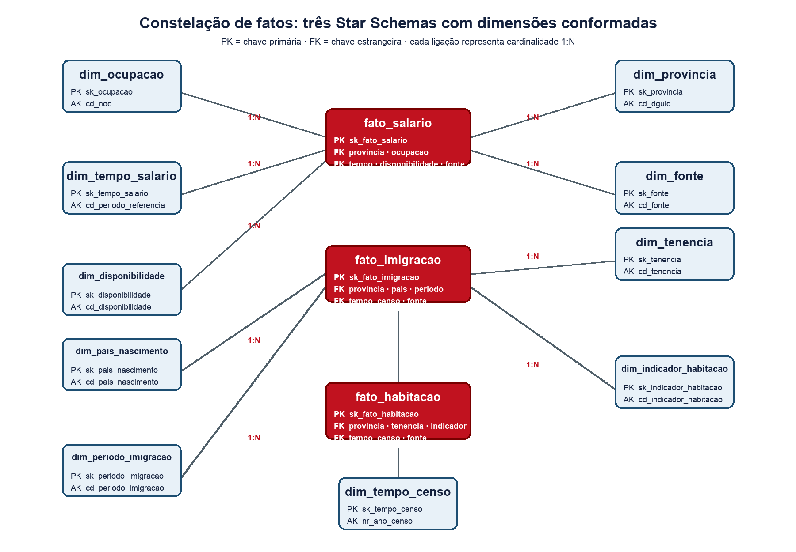
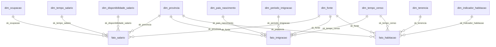

# Modelo Lógico/Físico do Data Warehouse

Modelo proposto para a Entrega 1: uma **constelação de fatos composta por três Star Schemas integrados por dimensões conformadas**. Salários, imigração e habitação compartilham `dim_provincia` (e cada fato tem sua própria dimensão de tempo, pois as bases têm referências temporais diferentes). Essa separação evita repetir salários em cada período de imigração e produzir somas incorretas.

## 1. Diagrama dimensional



A figura apresenta PKs, FKs e cardinalidades 1:N. Cada fato tem o próprio grão; `dim_provincia`, `dim_fonte` e `dim_tempo_censo` são dimensões conformadas reutilizadas quando aplicável.



Representação textual (visão geral):

```
dim_provincia ──┬── fato_salario ── dim_ocupacao
                 │        ├────────── dim_tempo_salario
                 │        └────────── dim_disponibilidade_salario
                 ├── fato_imigracao ── dim_pais_nascimento
                 │        ├─────────── dim_periodo_imigracao
                 │        └─────────── dim_tempo_censo
                 └── fato_habitacao ── dim_tenencia
                          ├─────────── dim_indicador_habitacao
                          └─────────── dim_tempo_censo
```

## 2. Dimensões

| Dimensão | Chave substituta | Chave de negócio (natural) | Atributos principais |
|---|---|---|---|
| `dim_provincia` | `sk_provincia` | `cd_dguid` (StatCan) | `nm_provincia`, `sg_provincia_jobbank`, `nm_pais` |
| `dim_ocupacao` | `sk_ocupacao` | `cd_noc` | `nm_ocupacao_en`, `nm_ocupacao_fr` |
| `dim_tempo_salario` | `sk_tempo_salario` | `cd_periodo_referencia` | `nr_ano_inicio`, `nr_ano_fim`, `ds_periodo` |
| `dim_disponibilidade_salario` | `sk_disponibilidade_salario` | `cd_disponibilidade` | `ds_disponibilidade`, `fl_comparavel_provincial` |
| `dim_tempo_censo` | `sk_tempo_censo` | `nr_ano_censo` | `dt_referencia` |
| `dim_pais_nascimento` | `sk_pais_nascimento` | `cd_pais_nascimento` | `nm_pais_nascimento` |
| `dim_periodo_imigracao` | `sk_periodo_imigracao` | `cd_periodo_imigracao` | `ds_periodo_imigracao`, `nr_ordem` |
| `dim_tenencia` | `sk_tenencia` | `cd_tenencia` | `ds_tenencia` |
| `dim_indicador_habitacao` | `sk_indicador_habitacao` | `cd_indicador_habitacao` | `ds_indicador_habitacao`, `tp_medida` (`CONTAGEM`/`PERCENTUAL`) |
| `dim_fonte` | `sk_fonte` | `cd_fonte` | `nm_fonte`, `ds_url`, `dt_extracao`, `ds_checksum` |

Observações:
- Todas as dimensões usam **surrogate keys** (`NUMBER` gerado por sequência), conforme a aula de Modelagem Dimensional.
- `dim_provincia` é a dimensão **conformada** compartilhada pelos três fatos.
- `dim_tempo_salario` e `dim_tempo_censo` são dimensões distintas (role-playing de tempo), porque os salários são 2023–2024 e os dados de imigração/habitação são do Censo 2021.
- `dim_fonte` registra URL, data de extração, versão e checksum de cada origem.

## 3. Fatos

| Fato | Grão | Medidas | Aditividade |
|---|---|---|---|
| `fato_salario` | Jurisdição + ocupação + período salarial | Valores salariais, `fl_salario_anual`, `cd_regiao_origem`, `nm_regiao_origem` | O status vem de `dim_disponibilidade_salario`: `PROVINCIAL_PUBLICADO`, `APENAS_REGIONAL` ou `INDISPONIVEL`. Salários provinciais são comparáveis; regionais não entram em ranking provincial; indisponíveis mantêm valores `NULL`. |
| `fato_imigracao` | Província + país de nascimento + período de imigração + Censo | `qt_imigrantes` (contagem) | `qt_imigrantes` é aditiva. A **participação brasileira (%) não é armazenada** — é calculada no BI como `qt_imigrantes(Brazil) / qt_imigrantes(Total – Place of birth)`. |
| `fato_habitacao` | Província + posse (tenure) + indicador habitacional + Censo | `vl_medida` (contagem ou percentual, conforme `dim_indicador_habitacao.tp_medida`) | Contagens são aditivas; percentuais são não aditivos — usar como valor pontual por província. |

## 4. Mapeamento origem → destino (resumo)

| Origem (dataset público) | Destino (DW) | Regra |
|---|---|---|
| Job Bank `prov` + `ER_Code` + `ER_Name` | `dim_provincia`, `dim_disponibilidade_salario`, `fato_salario.cd_regiao_origem`, `fato_salario.nm_regiao_origem` | Classificar 13 jurisdições: 9 `PROVINCIAL_PUBLICADO`, PEI `APENAS_REGIONAL` (ER1110) e 3 territórios `INDISPONIVEL`; não transformar regional em provincial |
| Job Bank `NOC_CNP`, `NOC_Title_eng` | `dim_ocupacao` | Filtrar `NOC_CNP = NOC_21232` |
| Job Bank `Low/Median/High_Wage`, `Reference_Period`, `Annual_Wage_Flag` | `fato_salario` | `Reference_Period = 2023-2024`; flag `0` = por hora; nunca estimar vazios |
| StatCan `DGUID`, `GEO` | `dim_provincia` | DGUID canônico; eliminar duplicidade de Yukon |
| StatCan `Place of birth`, `Immigrants[3]`, períodos `[4]..[8]` | `fato_imigracao`, `dim_pais_nascimento`, `dim_periodo_imigracao` | Filtrar `Brazil` e `Total – Place of birth`; Age/Gender totais |
| StatCan habitação `Housing indicators`, `Tenure (4):…` | `fato_habitacao`, `dim_indicador_habitacao`, `dim_tenencia` | Filtrar 13 províncias/territórios e `Census year = 2021` |

## 5. Decisões de modelagem

1. **Três fatos separados** — um tema distinto por fato, sem misturar granularidades (recomendação da aula: não misturar granularidades na mesma tabela fato).
2. **Dimensões conformadas** — `dim_provincia` e `dim_tempo_censo` são reutilizadas entre fatos.
3. **Surrogate keys em todas as dimensões** — as chaves naturais (`DGUID`, `NOC_CNP`, códigos StatCan) ficam como `AK` (alternate keys) para o ETL fazer o *lookup*.
4. **Tratamento de percentuais** — a participação brasileira não é armazenada e é calculada na camada de apresentação a partir das contagens de brasileiros e do total de imigrantes. Os percentuais habitacionais fornecidos oficialmente pelo Statistics Canada são armazenados em `fato_habitacao.vl_medida`, identificados por `dim_indicador_habitacao.tp_medida = 'PERCENTUAL'`, e tratados como medidas não aditivas.
5. **Cobertura salarial explícita** — `fato_salario` recebe uma linha para cada uma das 13 jurisdições no recorte NOC 21232. `dim_disponibilidade_salario` diferencia `PROVINCIAL_PUBLICADO`, `APENAS_REGIONAL` e `INDISPONIVEL`; dados regionais não são comparados como provinciais e valores indisponíveis permanecem `NULL`. O indicador combinado filtra `fl_comparavel_provincial = 1`.
